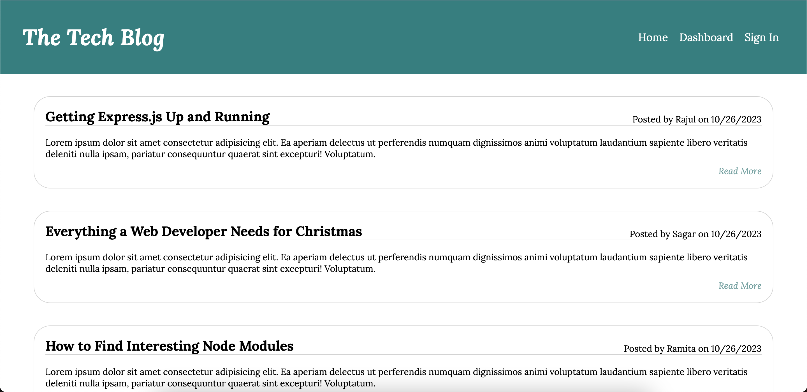

# MVC Tech Blog

## UCLA Bootcamp Module 14 Challenge

## Description

This project is a blog. Users can:

1. Sign up or sign in for an account on the blog.
2. Access the home page and see all the blog post titles, content, author and date created.
3. Click on any blog post to read in full.
4. When signed in, users can leave comments on any blog post.
5. When signed in, users can access the dashboard where they can see their own posts, update the posts, add new posts and delete posts. 
5. Logout from the website.

## Installation

To install, run `npm install`.

To seed the database, run `npm run seed`.

To start, run `npm start`.

## Usage

This project has been deployed using Heroku at: https://mvc-tech-blog-indurkhya-ecc84c878b3c.herokuapp.com/.

## Credits

This project was created by Ramita Indurkhya.
